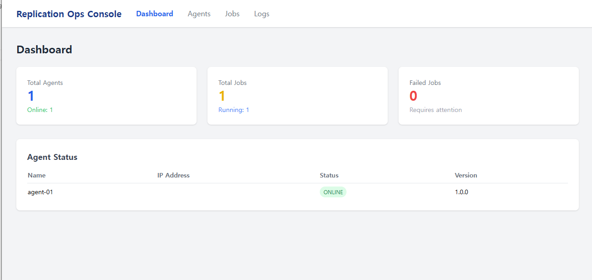
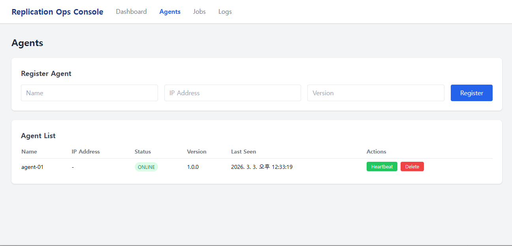
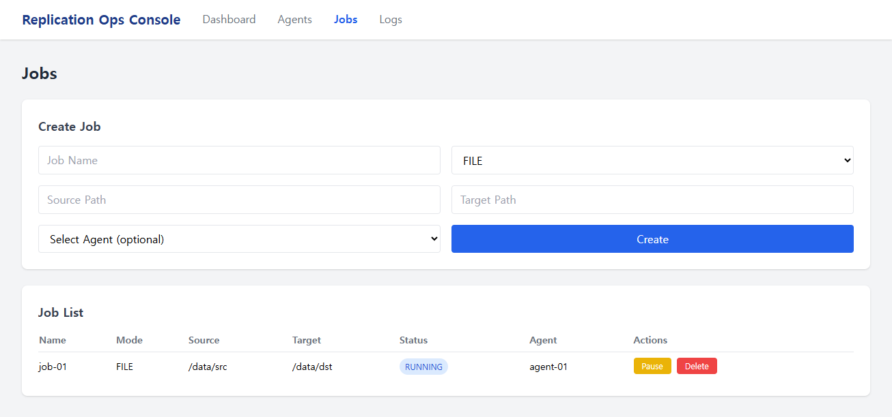
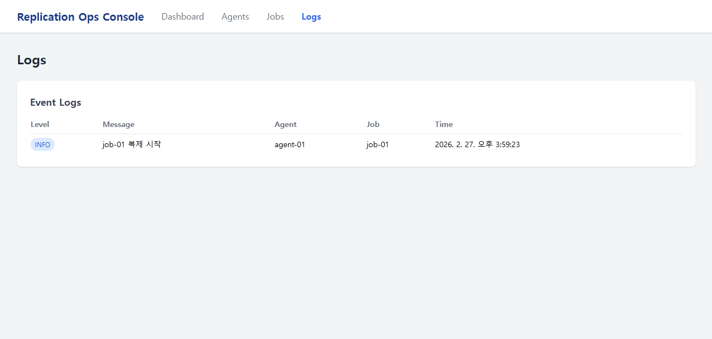

# Replication Ops Console

파일/블록 복제 솔루션의 통합 관리 콘솔입니다.
맨텍솔루션 MCCS(Mantech Continuous Cluster Server) 도메인을 기반으로 설계했습니다.

## 화면 미리보기

> 스크린샷 추가 예정

## 기술 스택

**Backend**
- Node.js + TypeScript
- Express
- TypeORM + SQLite

**Frontend**
- React + TypeScript
- Tailwind CSS + shadcn/ui
- Axios

**Test**
- Playwright (E2E)

## 프로젝트 구조
```
replication-ops-console/
├── apps/
│   ├── api/         # 백엔드 API 서버
│   └── web/         # React 프론트엔드
└── docs/            # 설계 문서
    ├── usecase.drawio
    ├── ui.drawio
    ├── erd.drawio
    ├── api.drawio
    └── wireframe.drawio
```

## 주요 기능

- Agent 등록/조회/수정/삭제/Heartbeat
- 복제 Job 생성/시작/일시정지/삭제
- Job 상태 관리 (READY → RUNNING → PAUSED/SUCCESS/FAILED)
- 이벤트 로그 조회 (INFO/WARN/ERROR)
- 대시보드에서 전체 현황 한눈에 보기

## 실행 방법

**백엔드 서버**
```bash
cd apps/api
npm install
npm run dev
```

**프론트엔드 서버**
```bash
cd apps/web
npm install
npm run dev
```

백엔드: http://localhost:3000
프론트엔드: http://localhost:5173

## 설계 문서

| 문서 | 설명 |
|------------------|-----------------------------------|
| usecase.drawio   | 유스케이스 다이어그램               |
| erd.drawio       | ERD (Entity Relationship Diagram) |
| api.drawio       | API 설계서                         |
| ui.drawio        | UI 화면 구조도                     |
| wireframe.drawio | UI 와이어프레임                    |

## API 엔드포인트

| Method | URL | 설명 |
|--------|-----|------|
| GET | /api/v1/agents | Agent 목록 조회 |
| POST | /api/v1/agents | Agent 등록 |
| PATCH | /api/v1/agents/:id | Agent 수정 |
| DELETE | /api/v1/agents/:id | Agent 삭제 |
| POST | /api/v1/agents/:id/heartbeat | Heartbeat |
| GET | /api/v1/jobs | Job 목록 조회 |
| POST | /api/v1/jobs | Job 생성 |
| POST | /api/v1/jobs/:id/start | Job 시작 |
| POST | /api/v1/jobs/:id/pause | Job 일시정지 |
| DELETE | /api/v1/jobs/:id | Job 삭제 |
| GET | /api/v1/logs | 로그 조회 |
| POST | /api/v1/logs | 로그 생성 |

## 화면 미리보기

**Dashboard**


**Agents**


**Jobs**


**Logs**
